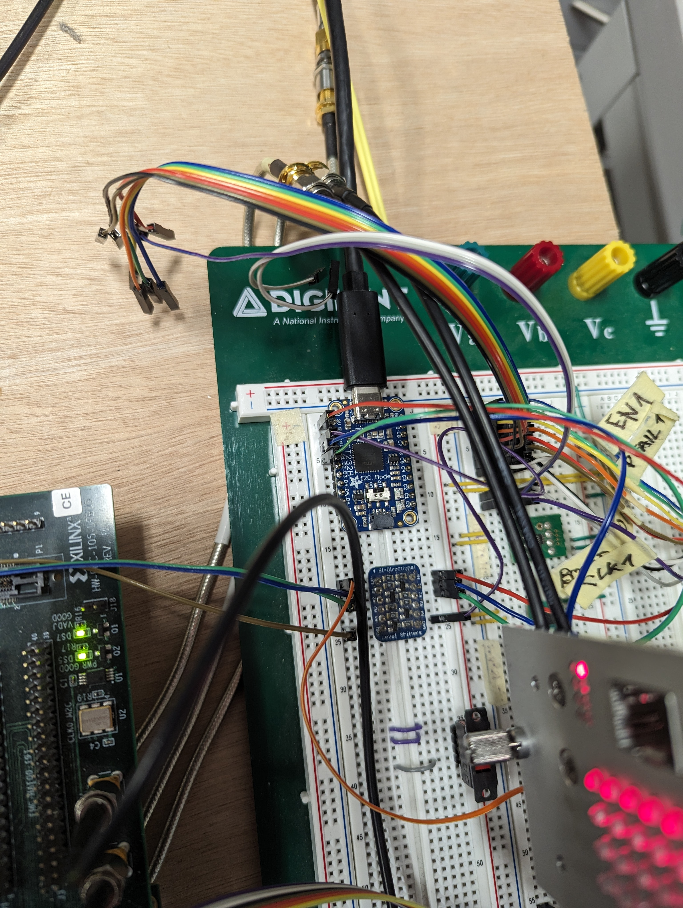

# MCOI XU5 complete design

# DEVKIT DEVELOPMENT
To run our setup we need Enclustra PE1 and XU5 module with the PCIe2SFP custom
made board and the rev. 1.0 of the MCOI XU5 board, which generates the
reference clock for the PE1 pll connected to the XU5 module.
The MCOI XU5 PLL generates 25MHz LVDS 1V8 on the channel 0 and the PE1 PLL
takes the signal on IN5 and IN6 pins and generates 120MHz LVDS 1V8 on the
channel 1 and for the quick check, if the PLL is running we generate the
single-ended clock 3V3 on the channel 2. 
There had to be a major change made on the PE1, that we could use the CLKIN+
and CLKIN-, which pass througt a mux. This was pulled up physically on the
board. 

The PE1 went through certain changes. The UART pins had to be lifted up from
the pcb that the pins are not influenced by the PE1 FTDI chip. Those pins were
connected to the PE1 FT232h chip through the contact array.

To be able to test the functionality, since the setup is in the lab, we use the
hw_server CMD command in Windows. This creates server, which can comunicate
with the JTAG programmer connected via USB to the same computer. You can then
start vitis on your local computer and create a debugging configuration (click
on the arrow next to the bug icon). After that you create new configuration
(don't use the GDB option, because there is something wrong according to the
Xilinx forum). Then you can start the debugging session by clicking on your
newly created debugging profile (follow the fw/README.md). The FPGA should be
loaded and you should see the output in the serial consol, if you opened it on
the Windows machine before running the app. 

The reset of the design is connected to the sfp los signal (notice the white
cable in the picture connecting the devkit an the IOB header and the SFP los on
the PCIe2SFP), so if you disconnect the fiber from the sfp, the design is in
reset.
In case of UART, the wires are pulled out via the green and blue wires,
connected to the external breakout board FT232h.
The LED display is connected right to the FMC XM105 Card. The MCOI XU5 has
wires soldered to the tracks controling the first motor of the EU crate. They
are going to be connected to the FMC XM105 Card as well. 

## IMPORTANT NOTES
* If we want to use the si5338b-b-gmr with the onboard oscilator on the PE1 we
  need to use just the capacitors c1606 and c1607 and unmount the c1604 and
  c1605

## LINKS
* [FMC XM105 Card](https://www.xilinx.com/products/boards-and-kits/hw-fmc-xm105-g.html) 
* [Enclustra PE1 Schematics](https://download.enclustra.com/public_files/Base_Boards/Mercury+_PE1/Mercury_PE1-R4-6_User_Schematics_V4.pdf)
* [Enclustra XU5 Schematics](https://download.enclustra.com/public_files/SoC_Modules/Mercury_XU5/Mercury_XU5-R1-2_User_Schematics_V18.pdf)

## DEVKIT PINOUT
* connector j20 fmc xm105 card
    * csel0 - LA20_P 
    * csel1 - LA20_N
    * csel2 - LA21_P
    * sin   - LA21_N
    * blank - LA22_P
    * sclk  - LA22_N
    * latch - LA23_P

* connector j2 fmc xm105 card
    * PL_CLK - LA00_CC_P
    * PL_EN - LA00_CC_N
    * PL_BOOST - LA01_CC_P 
    * mreset - LA01_CC_N
    * fpga_ok - LA02_P 
    * PL_SW_OUT_A - LA02_N
    * PL_SW_OUT_B - LA03_P
    * PL_PFAIL - LA03_N
    * PL_DIR - LA04_P
    * LED_0 - LA10_P
    * LED_1 - LA10_N
    * LED_2 - LA11_P
    * LED_3 - LA11_N
    * LED_4 - LA12_P
    * LED_5 - LA12_N
    * LED_6 - LA13_P
    * RS485_PL_RO - LA09_N
    * RS485_PL_DI - LA09_P
