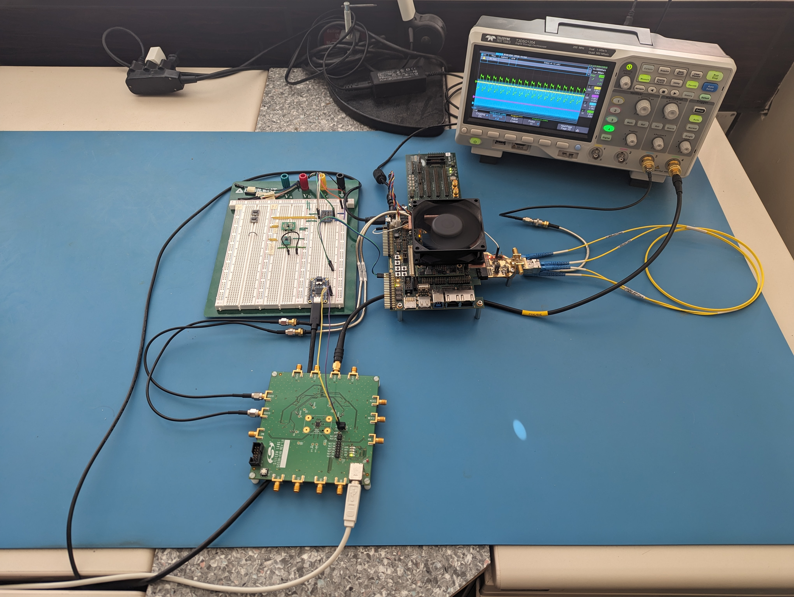

# MCOI XU5 complete design

# DEVKIT DEVELOPMENT
To run our setup we need Enclustra PE1 and XU5 module with the PCIe2SFP custom
made board. than create the loopback on the SFP and Flash the firmware in the 
module. This can be done in the Vitis, if you follow the fw/README.md, you can 
if your device is visible for the computer, Vitis will write the FW and GW.
Then you need to go to Vivado and open the Logic analyzer and you can wait for
the transition of the rx_ready or link_ready signals.

The reset of the design is connected to the sfp los signal (notice the white
cable in the picture connecting the devkit an the IOB header and the SFP los on
the PCIe2SFP), so if you disconnect the fiber from the sfp, the design is in
reset. When you connect it back, it will trigger the logic analyzer and you
should see data counting data on the output, because on the input is a 32-bit
counter.

## IMPORTANT NOTES
* If we want to use the si5338b-b-gmr with the onboard oscilator on the PE1 we
  need to use just the capacitors c1606 and c1607 and unmount the c1604 and
  c1605

